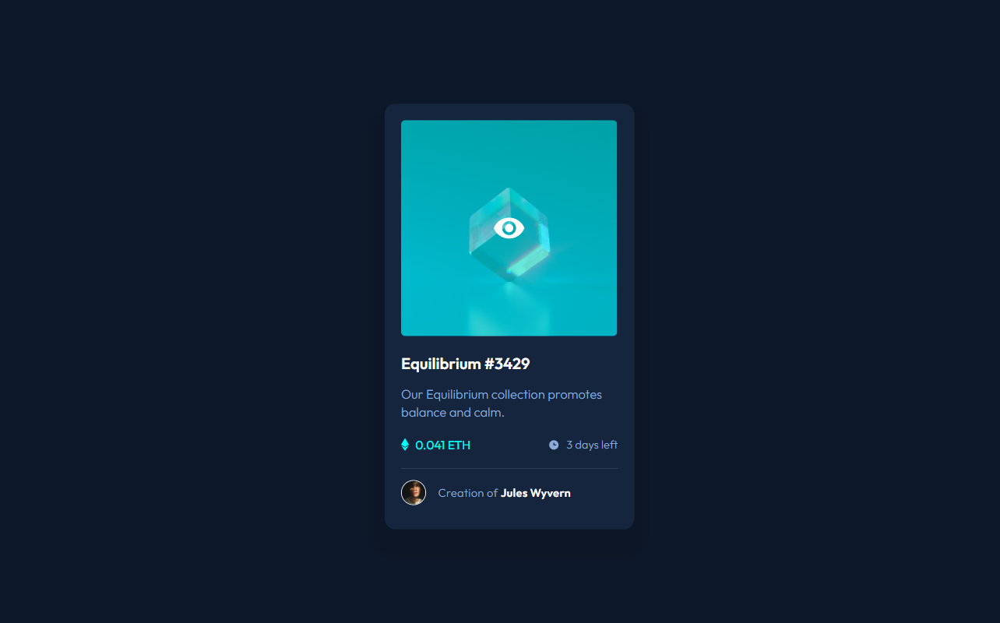

# NFT preview card component solution

This is a solution to the [NFT preview card component challenge on Frontend Mentor](https://www.frontendmentor.io/challenges/nft-preview-card-component-SbdUL_w0U).

## Table of contents

- [Overview](#overview)
  - [The challenge](#the-challenge)
  - [Screenshot](#screenshot)
  - [Links](#links)
- [My process](#my-process)
  - [Built with](#built-with)
  - [What I learned](#what-i-learned)

## Overview

### The challenge

Users should be able to:

- View the optimal layout depending on their device's screen size
- See hover states for interactive elements

### Screenshot



### Links

- Live Site URL: [https://mateus3009.github.io/NFT-preview-card-component/](https://mateus3009.github.io/NFT-preview-card-component/)

## My process

### Built with

- HTML
- CSS

### What I learned

In this project I learned how to set multiple backgrounds and box-shadows to my components:

```css
  div {
    box-shadow: 0 23px 10px 17px rgba(0, 0, 0, .1), 0 15px 20px 50px rgba(0, 0, 0, .03);
    /* just put a comma between the shadow parameters */
  }
```
```css
  div {
    background: url('images/bg.svg') no-repeat center center, (rgba(0, 0, 0, .4) 100%, rgba(0, 0, 0, .4) 100%);
    /* you can't mix background image and color so you can use a trick: linear-gradient */
  }
```
